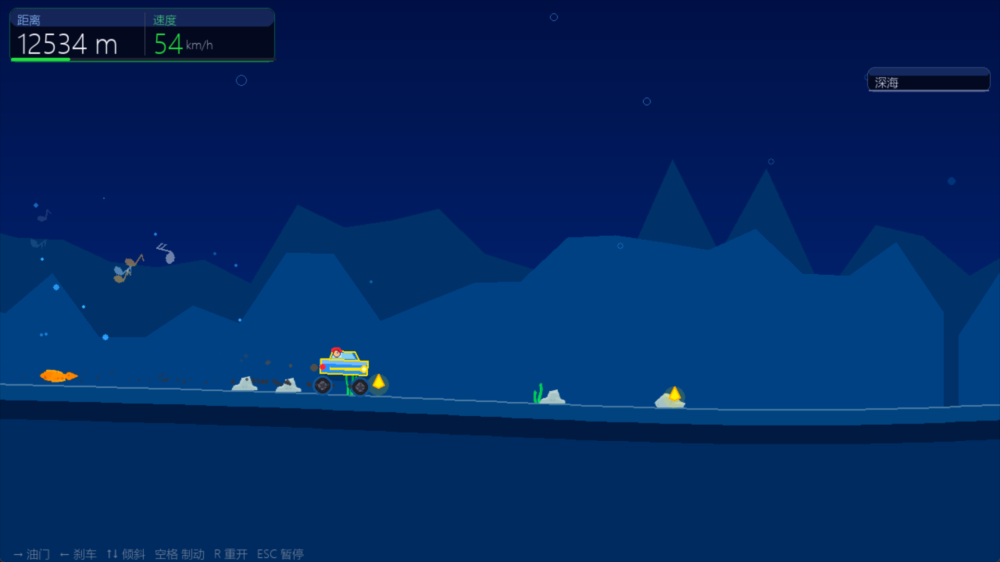
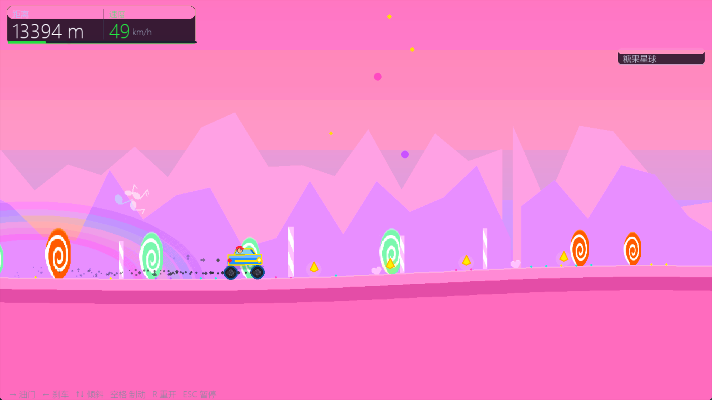
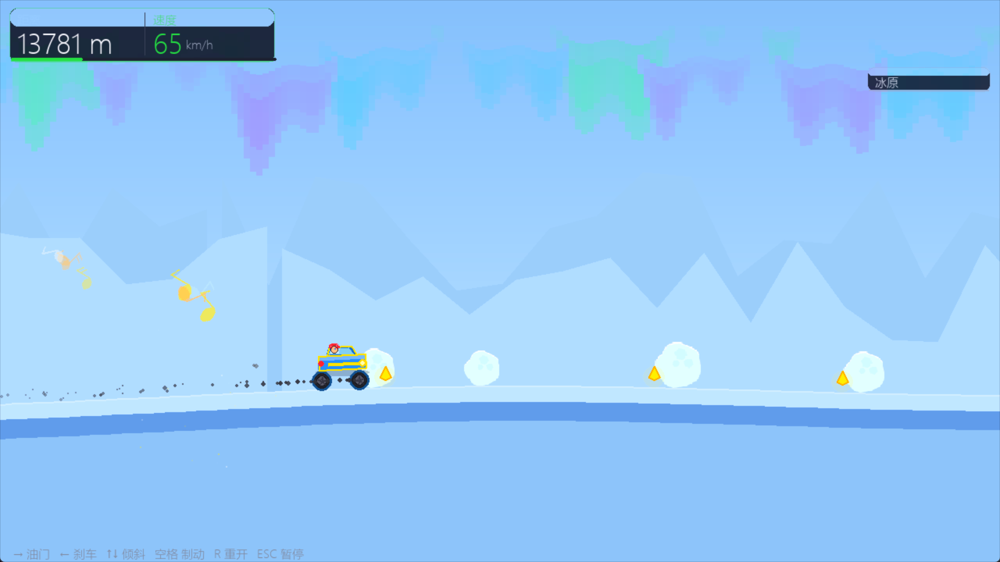

<div align="center">

# 🚗 车之旅 · CarJourney

**一款融合音乐卡点与番茄钟的休闲赛车游戏**

*A casual racing game with music beat-sync and Pomodoro timer*


</div>

---

## 📸 预览 · Preview

<table>
  <tr>
    <td align="center"><br/><sub>🌊 深海地形</sub></td>
    <td align="center"><br/><sub>🍭 糖果星球</sub></td>
  </tr>
  <tr>
    <td align="center" colspan="2"><br/><sub>❄️ 冰原地形（音符特效飘起）</sub></td>
  </tr>
</table>

---

## ✨ 特色功能 · Features

### 🎵 音乐卡点模式
- 自动分析你的音乐文件，**智能检测节拍**（支持 WAV / MP3 / OGG）
- 节拍菱形动态投影到车前方，**精准踩点**，碾过瞬间爆发音符特效
- 节拍缓存机制，第二次选歌**秒开**

### 🍅 番茄钟模式
- 专注时全速冲刺，休息时悠闲漫步，**用开车感受时间流逝**
- 自动记录每次专注，查看今日 / 本周 / 连续打卡历史
- 支持同时开启背景音乐 + 卡点，专注时间更沉浸

### 🎮 游玩模式
- 自由驾驶，路面密集障碍随机生成
- 7 种地形：草原 · 沙漠 · 冰原 · 深海 · 月面 · 霓虹都市 · 熔岩

---

## 🚘 三辆小车 · Cars

| 车辆 | 限速 | 特点 |
|------|------|------|
| **云游** | 120 km/h | 稳如泰山 · 看风景专用 |
| **逐风** | 240 km/h | 追风而驰 · 正常驾驶 |
| **离弦** | 无限速 | 一触即飞 · 神经病专用 |

---

## 🕹️ 操控说明 · Controls

| 按键 | 功能 |
|------|------|
| `→` | 油门 |
| `←` | 刹车 / 倒车 |
| `↑ / ↓` | 空中倾斜车身 |
| `空格` | 紧急制动 |
| `ESC` | 暂停 |
| `M` | 返回菜单 |

---

## 🚀 快速开始 · Quick Start

### 运行源码

```bash
# 安装依赖
pip install pygame numpy

# 运行
python main.py
```

### 使用音乐卡点功能

1. 将 MP3 / WAV / OGG 音乐文件放入 `Music/` 文件夹
2. 主菜单 → **背景音乐** → 选歌 → 按 `B` 开启卡点
3. 主菜单 → **音乐模式** → 选车 → 开始享受 🎵

### 打包为 exe

```bash
pip install pyinstaller
pyinstaller CarJourney.spec
# 输出在 dist/CarJourney.exe
```

---

## 📁 项目结构 · Project Structure

```
CarJourney/
├── main.py                  # 全部源码（单文件）
├── CarJourney.spec          # PyInstaller 打包配置
├── icon.ico / icon.png      # 图标
├── game/assets/
│   ├── audio/               # 音效文件
│   └── sprites/             # 地形装饰 PNG
├── Music/                   # 放你的音乐（运行后自动创建）
└── data/                    # 存档数据（运行后自动创建）
    ├── pomodoro_log.json    # 番茄钟历史
    └── beat_cache.json      # 节拍分析缓存
```

---

## 🛠️ 技术栈 · Tech Stack

- **Python 3.12** + **Pygame 2.6**
- 物理引擎：自制弹簧悬挂 + 刚体碰撞
- 节拍分析：自适应 onset detection + 自相关 BPM 估算
- 视差背景：多层滚动 + 程序化地形生成
- 零外部素材依赖（所有图形均由代码绘制）

---

## 📄 许可证 · License

MIT License — 自由使用、修改、分发，保留署名即可。

---

<div align="center">
Made with ☕ and pygame
</div>
